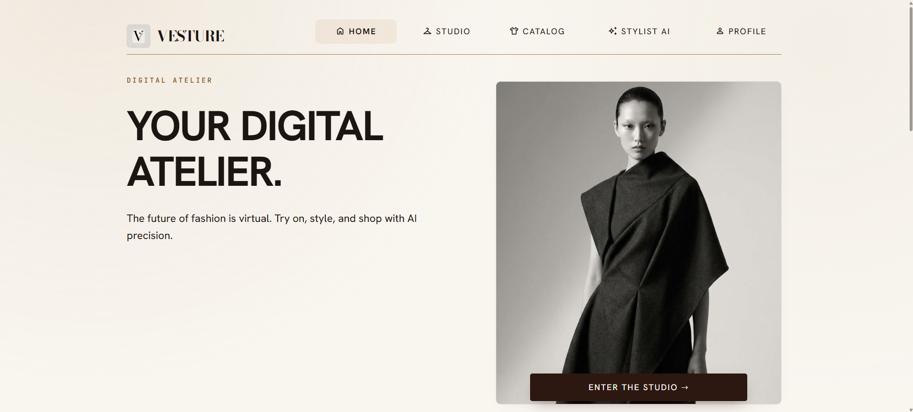
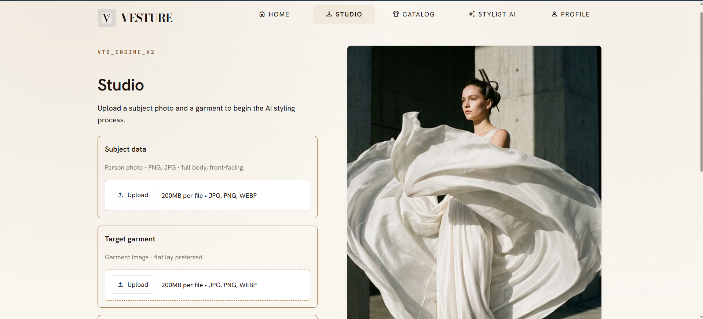
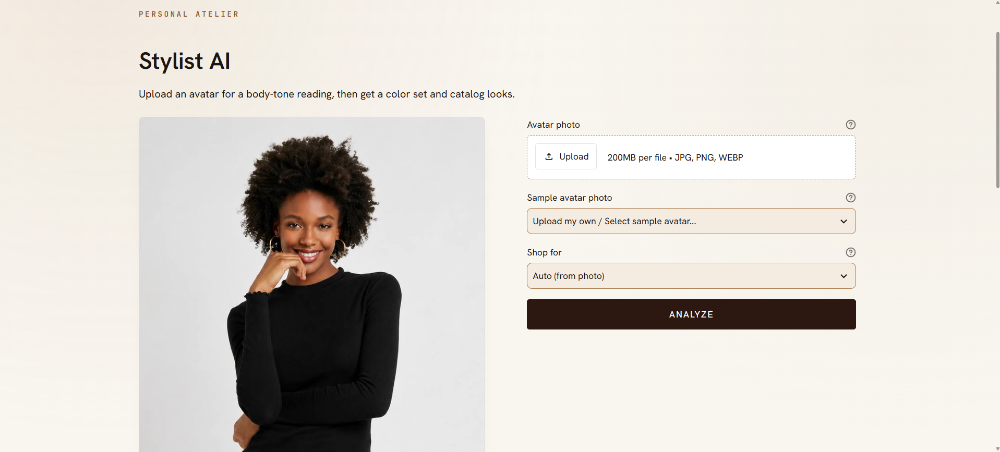

# Virtual Clothing Try-On (VESTURE)




Streamlit app for virtual try-on plus a Fashion Stylist AI.

**Pipeline:** SegFormer clothing segmentation → **IDM-VTON** (upper) / **CatVTON** (lower + fallback) / SD2 / local overlay → FashionCLIP Top-5 → optional **Gemini** stylist (analysis, chat, voice, PDF).

`HF_TOKEN` is required for live try-on (Hugging Face Spaces / Inference API). `GOOGLE_API_KEY` is optional for Gemini captions, advice, and chat; **voice transcription needs the key**. The same key is the Google AI Studio Gemini key (`GEMINI_API_KEY` also works).


## Features

- Upload a full-body person photo + garment, or pick a VITON-HD demo pair
- SegFormer mask with **segmentation confidence**; hard gate at **0.85** before try-on
- Garment-**image** try-on: IDM-VTON Space for **upper** only; CatVTON `/submit_function` for **lower** / dress and Space queues; SD2 via HF router; **local overlay** last
- Composite **try-on confidence** = `0.4·seg + 0.4·CLIP + 0.2·mask_quality`
- Studio Top-5 similar items + **Buy / Find online** (Google Shopping)
- Stylist AI **Analyze:** 12-season body tone, palette, silhouette, **Shop for** Auto / Woman / Man
- Catalog looks filtered by **menswear / womenswear**, palette boost, and avoid-colors
- Chat stays empty until you type; markdown replies; up to 3 catalog titles
- Look requests (e.g. “I want a black dress”) use **HF Serverless Router / Granite LLM** (`meta-llama/Llama-3.1-8B-Instruct` / `Qwen2.5` / Granite) with automatic Gemini LLM fallback to write a structured shopping prompt (JSON), then FashionCLIP retrieves matching catalog tiles. Gemini handles general chat, Analyze, voice, and captions.
- **Garment Color Tinting**: Preprocesses upper/lower/dress garments with HSL/LAB hue-rotation (`tint_garment` in `src/preprocess.py`) to customize garment shades before virtual try-on.
- **Hair Color Change**: Detects hair regions via SegFormer segmentation (label 2) and applies custom hair recoloring (`apply_hair_color` in `src/tryon.py`) on subject portraits.
- Voice: Gemini STT → **editable** text → Send / Discard (does not auto-send)
- **Download analysis PDF** after Analyze: season, body tone, body type, color set, silhouette (no catalog list)
- Gemini garment caption, advice, and result explanation (template fallback if no key)

## Models

| Model | HF ID / API | Runs on |
| --- | --- | --- |
| SegFormer-B2 Clothes | `mattmdjaga/segformer_b2_clothes` | Local CPU |
| IDM-VTON (upper) | `yisol/IDM-VTON` Space `/tryon` | HF Space GPU |
| CatVTON (lower + fallback) | `zhengchong/CatVTON` `/submit_function` | HF Space GPU |
| Stable Diffusion 2 Inpainting | `stabilityai/stable-diffusion-2-inpainting` via `router.huggingface.co/hf-inference` | HF Inference API |
| Local overlay & Hair colorizer | `run_local_overlay` / `apply_hair_color` in `src/tryon.py` | Local CPU |
| Garment color tinter | `tint_garment` in `src/preprocess.py` | Local CPU |
| Marqo FashionCLIP | `Marqo/marqo-fashionCLIP` | Local CPU |
| Gemini 2.5 / 3.6 Flash | Google Generative AI API | Cloud API |
| HF Router & Granite (look prompts) | `meta-llama/Llama-3.1-8B-Instruct` / `Qwen2.5` / Granite via `router.huggingface.co` | HF Inference (`HF_TOKEN`) |

Fallback for recommendations: `openai/clip-vit-base-patch32`.

IDM-VTON / CatVTON weights are **CC-BY-NC-SA 4.0** (fine for a class demo).

## Datasets (referenced / used)

| Dataset | Role | Link |
| --- | --- | --- |
| ATR / `mattmdjaga/human_parsing_dataset` | SegFormer provenance (in the weights) | [HF](https://huggingface.co/datasets/mattmdjaga/human_parsing_dataset) |
| VITON-HD | Try-on training provenance + optional Studio demo pairs | [GitHub](https://github.com/shadow2496/VITON-HD) |
| Dress Code | Multi-category citation | [GitHub](https://github.com/aimagelab/dress-code) |
| DeepFashion | Retrieval literature; catalog style | [CUHK](https://mmlab.ie.cuhk.edu.hk/projects/DeepFashion.html) |
| Marqo In-shop / Lamoda stills | Runtime catalog download for Top-5 | [In-shop](https://huggingface.co/datasets/Marqo/deepfashion-inshop) · [Lamoda](https://huggingface.co/datasets/PestoRosso/lamoda-fashion-product-images) |
| Kaggle Fashion Product Images | Same *style* as DF* titles | [Kaggle](https://www.kaggle.com/datasets/paramaggarwal/fashion-product-images-dataset) |
| Self-collected photos | Live demo | User upload |

You do **not** train on these. The app only needs a real product **catalog** plus person/garment photos.

## Setup

```bash
python -m venv .venv
# Windows:
.venv\Scripts\activate
# macOS/Linux:
# source .venv/bin/activate

pip install -r requirements.txt
copy .env.example .env   # then paste HF_TOKEN and optional GOOGLE_API_KEY
```

```env
HF_TOKEN=hf_xxx
GOOGLE_API_KEY=   # optional for copy/chat; required for voice
```

Build a real catalog (DeepFashion-style product photos + FashionCLIP embeddings):

```bash
python -m src.catalog_builder --from-deepfashion --n 90
```

Offline placeholder garments if the download fails:

```bash
python -m src.catalog_builder --placeholders --n 30
```

Optional VITON-HD-style Studio demo pairs:

```bash
python -m src.demo_samples --n 16
```

## Run

```bash
streamlit run app.py
```

After editing files under `src/`, **restart** Streamlit (`Ctrl+C`, then `streamlit run app.py`). A browser rerun can keep a stale module.

## Presentation fallback

If Spaces / the HF Inference API are slow or down, place cached try-on PNGs in `assets/demo/` (e.g. `tryon_01.png`). The app will show a fallback image and a warning. Lower-body try-on prefers a **local overlay** before stretching a cached upper-body demo.

## Project layout

```text
app.py
src/
  preprocess.py
  segmentation.py       # SegFormer, waist-clipped lower masks
  tryon.py              # IDM-VTON (upper) → CatVTON → SD2 router → overlay
  llm_advisor.py        # Gemini caption / JSON avatar / chat / STT
  stylist.py            # 12-season, presentation, catalog ranking
  analysis_report.py    # Stylist analysis PDF (fpdf2)
  confidence.py
  recommend.py          # FashionCLIP Top-5 + audience + color + Shopping URLs
  catalog_builder.py
  demo_samples.py
data/catalog/
data/samples/           # optional VITON-HD demo pairs
assets/demo/
```

## Course notes for slides

- Problem: online fashion try-before-you-buy
- Models: pretrained only (inference / transfer learning)
- Confidence gate 0.85 for segmentation; report try-on composite score
- Stylist: 12-season + menswear/womenswear recs + editable voice + analysis PDF
- Strengths: garment-conditioned try-on without a local GPU; DL + LLM hybrid
- Limits: Space queues / API latency; pose/occlusion failures; proxy confidence

## Quick Run

```bash
python -m venv .venv
.venv\Scripts\activate          # Windows
pip install -r requirements.txt
copy .env.example .env          # set HF_TOKEN and GOOGLE_API_KEY
python -m src.catalog_builder --from-deepfashion --n 90
python -m src.demo_samples --n 16
streamlit run app.py
```
